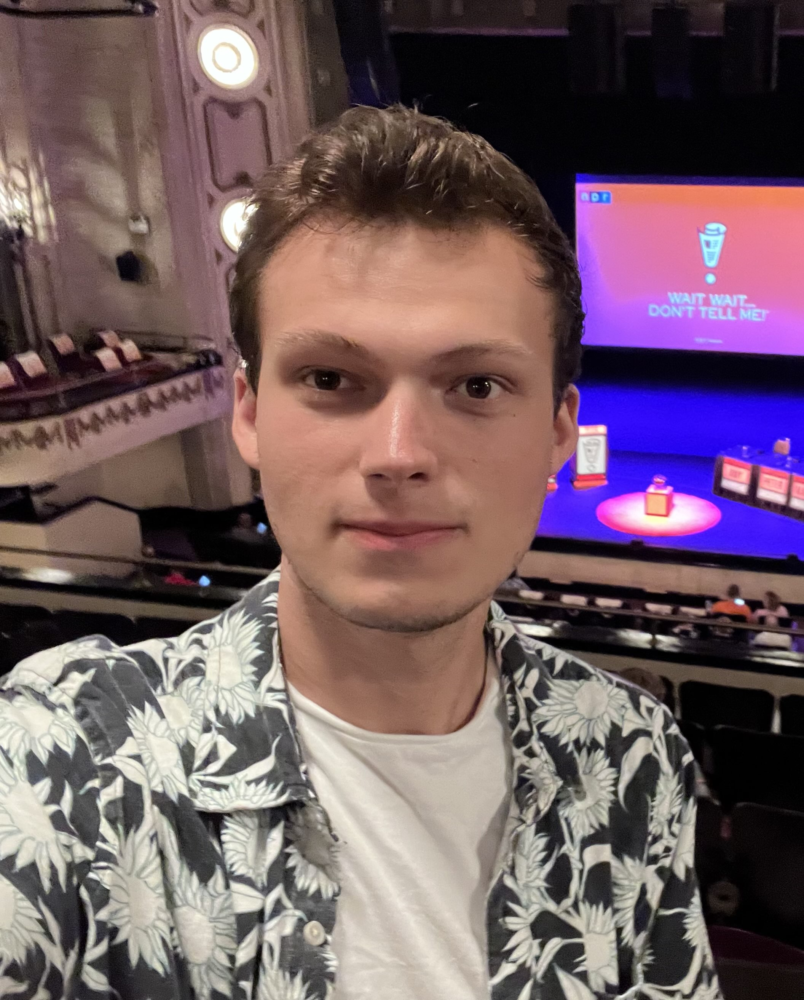

# Aidan Gardner-O'Kearny

Hey there! I'm Aidan Gardner-O'Kearny, an incoming physics PhD student at the University of Tennessee, Knoxville. I'm interested in high energy experiment, specifically searches for Beyond-the-Standard-Model physics utilizing exotic detector signatures. I'm also interested in the development of a 10 TeV Muon collider.

I worked as a part of the ATLAS Collaboration while I was an undergraduate at the University of Oregon. During my time there I worked on both a long-lived particle search and a search for BSM scalars.

Email: `aidan.gardnerokearny@cern.ch`

## Where To Find Me 
- [Linkedin](https://www.linkedin.com/in/aidangardnerokearny)
- [Gitlab](https://gitlab.cern.ch/agardner)
- [Github](https://github.com/aidangardnerokearny)

## [Some Old Work](Pages/SomeOldWork.md)
